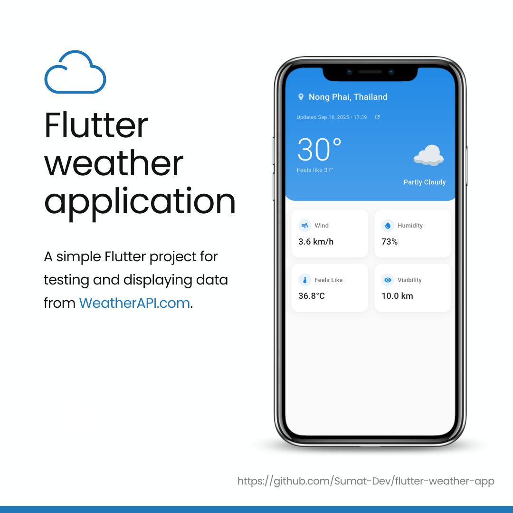

# Flutter Weather App

<p align="center">
  
</p>

A Flutter weather app that uses your device location to show current weather conditions.

## ✨ Features

- Current weather conditions
- Weather forecast
- Location-based weather data
- Beautiful and intuitive UI

## Setup

1. **Get a Weather API Key**
   - Sign up at [WeatherAPI.com](https://www.weatherapi.com/)
   - Get your free API key
   - Copy `.env.example` to `.env` and add your API key:

     ```env
     WEATHER_API_KEY="YOUR_API_KEY"
     ```

2. **Install Dependencies**

   ```bash
   flutter pub get
   ```

3. **Run the App**

   ```bash
   flutter run
   ```

## 🌤️ API Used

This app uses [WeatherAPI.com](https://www.weatherapi.com/) for weather data. The free tier includes:

- 1 million calls per month
- Current weather conditions
- No credit card required

## 📄 License

This project is licensed under the MIT License - see the [LICENSE](LICENSE) file for details.


***If you find this project helpful, please give it a ⭐️ star!***

